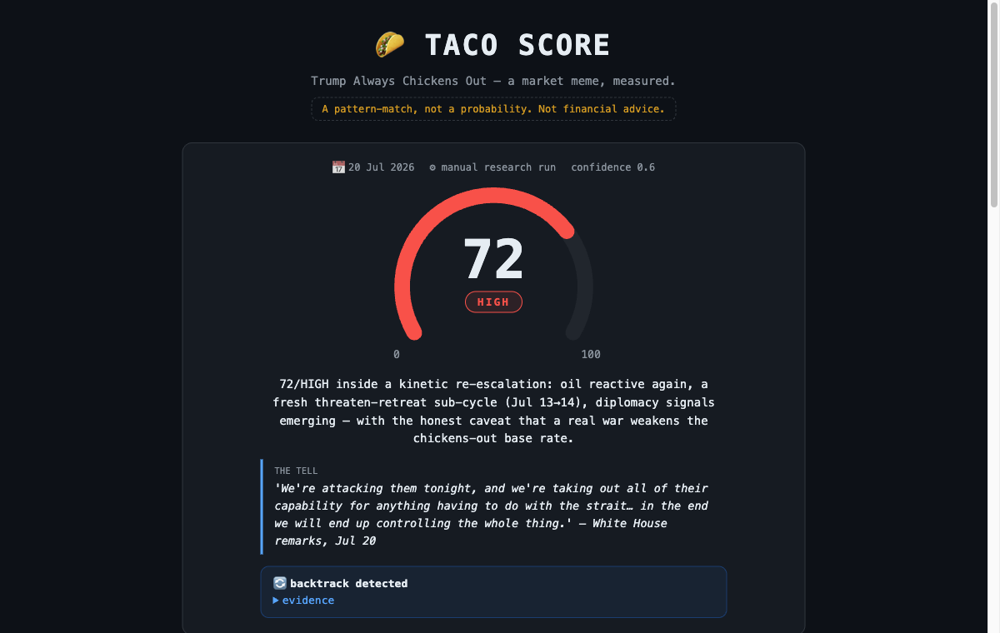

# 🌮 TACO Score

**Trump Always Chickens Out** — a market meme, measured.

**[Live demo →](https://hiroshigeg.github.io/taco-score/)** — ten real readings, one full cycle, March–July 2026. Click any point. Works offline too: it's one self-contained HTML file, no CDN, no build, no tracking.

## Can you measure a meme?

In 2025 the Financial Times coined the "TACO trade" — *Trump Always Chickens Out*: markets sell the escalation, then rip when he backs down. Traders joked about it. I wondered whether the joke could be made *measurable*: a 0–100 score that watches an escalation build and asks one question — **how much does today look like the days right before he backed down?**

This repo is the answer: the methodology, ten readings produced in real time while the events unfolded, and a page to explore them.

## What actually happened (the four-month live test)

| Date | Score | Level | Backtrack | |
|---|--:|---|:-:|---|
| Mar 31 | 58 | HIGH† | | escalation building |
| Apr 5 | 74 | HIGH | | threats compound, futures confirm |
| Apr 7 | 78 | **EXTREME** | | the peak reading |
| Apr 9 | 25 | LOW | 🔄 | **ceasefire announced, oil −16% in a day — pattern completed** |
| Jun 11–19 | 16–47 | LOW/MED | 🔄 | the quiet, read as quiet |
| Jul 1 | 47 | MEDIUM | 🔄 | rhetoric screams, oil *falls* — market not buying it |
| Jul 20 | 72 | HIGH | 🔄 | kinetic re-escalation, diplomacy signals inside |

The instrument watched the Iran/Hormuz escalation climb to **78/EXTREME** — and two days later the score collapsed to **25 with `backtrack_detected`** as a ceasefire landed and oil gave back 16% in a day. Through June it scored the cooldown in the teens. On **July 1** it refused to spike at 47 while rhetoric was at full volume, because the *heaviest* component — futures volume — saw oil falling: the market wasn't buying the threat. On **July 20** it read 72/HIGH inside a kinetic re-escalation and wrote down, in its own analyst note, exactly why its thesis was under stress.

These are not backtested numbers. Each JSON was produced on its date, warts included: three schema generations, proxied fields flagged as proxied, and one day where two conflicting runs were reconciled in writing (†the earliest readings also predate the standardized level thresholds — they are shown as recorded, with a footnote, not rewritten).

## Did it actually work?

Scored honestly: **one flagship predictive call** (the 78/EXTREME peak — a ceasefire landed within hours and oil gave back 16%), **zero false EXTREMEs**, two quiet months scored quiet, one refusal to spike that avoided a false alarm (Jul 1, rhetoric at maximum but the market wasn't moving), and one **split outcome called with its own caveat attached** (Jul 20 → Jul 21–22: the Hormuz toll was dropped, the blockade proceeded). Ten readings, one theme, no control group — **promising, not proven**, and the file that says so out loud is [`docs/track-record.md`](docs/track-record.md).

## How the score works

Seven weighted components, each scored 0–100 from public signals:

| Component | Weight | Measures |
|---|--:|---|
| Rhetoric intensity | 20 | how aggressive and *on-theme* the posts are |
| Futures volume anomaly | 20 | is the market actually moving on the story? (often the decisive tell) |
| Timing urgency | 15 | night/weekend posting patterns + proximity of macro events |
| DB pressure index | 15 | macro pressure to reverse course — modeled on Deutsche Bank's unpublished index (declared proxy) |
| Prediction-market spike | 10 | repricing in event-market odds |
| Historical precedent | 10 | how strong and recent the same-theme precedent is |
| Approval pressure | 10 | domestic political pressure to find an exit |

`score = round(Σ raw × weight / 100)` · **LOW** <33 · **MEDIUM** 33–66 · **HIGH** >66. De-escalation language (ceasefire, deal, backs down, pause, rollback…) sets a `backtrack_detected` flag with a quoted evidence trail. Full detail in [`docs/METHODOLOGY.md`](docs/METHODOLOGY.md).

## What this is NOT

- **Not a probability.** It's a pattern-match: "today resembles the historical setup" — nothing more.
- **A real war weakens the thesis.** The Jul 20 reading says this about itself: with kinetic escalation and real casualties, the chickens-out base rate degrades even at a high score. The instrument's own analyst note is on the page, unedited.
- **The pressure component is a proxy.** The original feed isn't shipped; the proxy is declared in the data, not hidden.
- **Some snapshot fields are marked "to re-validate"** in the raw files. Honesty lives in the data, not in the marketing.
- **Not financial advice.** Research and education.

## Prior art (and what's new here)

Measuring this is not a new idea — that's part of why it's a good one. The pieces existed; nobody had interfaced them:

- The **"TACO trade"** label was coined by Robert Armstrong at the Financial Times (May 2025) — it even has a Wikipedia page.
- **Deutsche Bank built the institutional index**: Maximilian Uleer's cross-asset team created a "Pressure Index" from four macro pain points (4-week changes in the S&P 500, the 10Y Treasury yield, 1Y inflation expectations, presidential approval — equal weight). Its formula and values were **never published**; the index is known only through press coverage. This repo documents a [public replication recipe](docs/db-pressure-proxy.md) — and uses the concept as *one component out of seven*.
- **JPMorgan's "Volfefe Index" (2019)** had already quantified Trump-tweet impact on Treasury volatility — the original measure-the-meme precedent.
- **Academic event studies** (2018–2021) repeatedly found that posts about trade, tariffs and the Fed moved futures, volatility and volume in measurable ways; sentiment and ALL-CAPS intensity are standard features in that literature.
- **Public archives** (the Trump Twitter Archive; Truth Social trackers) make the linguistic raw material — recurring phrases, posting times, day-of-week patterns — fully minable.

**What nobody had done is interface the layers.** DB's index reads only macro pain. Volfefe read only tweets against rates volatility. This instrument fuses the institutional pressure signal (rebuilt as a declared public proxy), the social-linguistic layer (rhetoric, CAPS, timing), the futures tape (is the market actually moving on the story?), prediction-market odds, historical pattern memory with a lifecycle state machine, and keyword-level backtrack detection — into one auditable number where every component carries its evidence. That composite, published while it happens, is the gap this repo fills.

The honest corollary is on the roadmap: mine the archives for phrase-level tells (the sign-off "thank you for your attention to this matter", night vs weekend timing) and validate the timing bonus empirically instead of by anecdote.

## How a reading is made

A human designed the instrument; an AI research pipeline does the daily legwork (signal collection → pattern analysis) under a strict JSON output contract; the arithmetic stays deterministic and auditable. The score is never "vibes": every component carries its raw value, weight, and a written evidence note — and the page recomputes `Σ raw × weight / 100` in front of you, including the one day it *doesn't* match the recorded score (there's a written reconciliation note for that too).

Pipeline design and the actual prompts (genericized): [`docs/pipeline.md`](docs/pipeline.md).

## Explore

- **[Live demo](https://hiroshigeg.github.io/taco-score/)** — or just open `index.html` from disk
- [`data/history.json`](data/history.json) — all ten readings, normalized
- [`examples/`](examples/) — three full readings: the EXTREME peak, the backtrack collapse, the kinetic HIGH
- [`docs/METHODOLOGY.md`](docs/METHODOLOGY.md) · [`docs/pipeline.md`](docs/pipeline.md)

## Roadmap

This is the instrument and its evidence. The productized version is designed but deliberately not built yet:

- [ ] pure scorer as an installable package (deterministic, fully tested)
- [ ] public adapters: Polymarket (Gamma API), futures volume, news/backtrack keywords
- [ ] CLI (`taco score`, `taco serve`) + small API
- [ ] scheduled daily public score via GitHub Action

## License

MIT. A personal research tool, published as-is. Not affiliated with any organization mentioned in the data.
